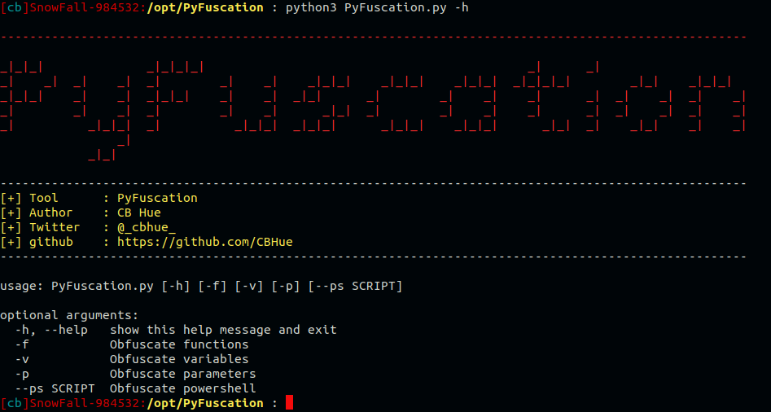

# PyFuscation

Requires python3. Previous versions and the original repo do not state it but 
the script relies heavily on sed. This version has replaced sed commands with
pure Python imporving Windows compatibility and future support.

usage: PyFuscation.py [-h] [-f] [-v] [-p] [--ps SCRIPT] 

Optional arguments: 

	• -h, --help show this help message and exit
  
	• -f    Obfuscate functions
		○ Do this First ... Its probably the most likely to work well
		
	• -v    Obfuscate variables
		○ If your going to obfuscate variables do the parameters too. 
		
	• -p    Obfuscate parameters
		○  If your going to obfuscate parameters do the variables too. 

Required arguments:
--ps  <SCRIPT> 	Obfuscate script 

	python3 PyFuscation.py -fvp --ps ./Scripts/Invoke-Mimikatz.ps1 
